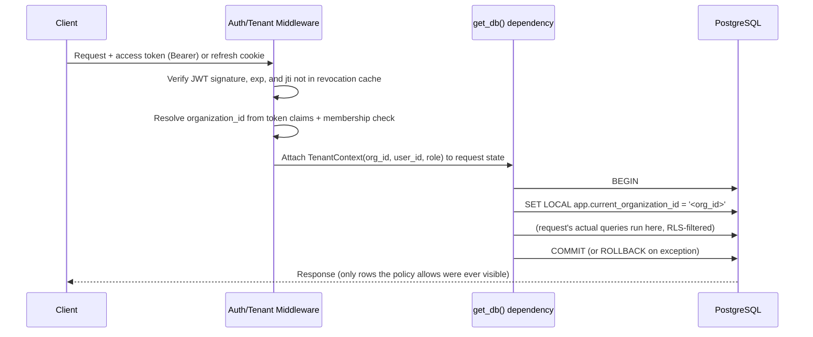
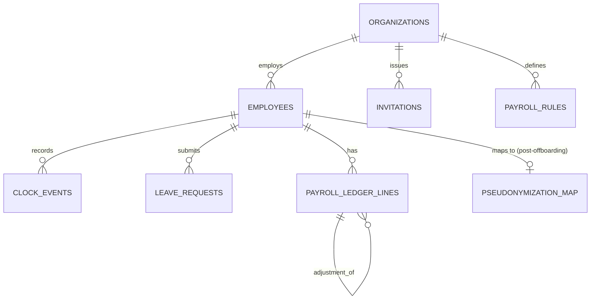
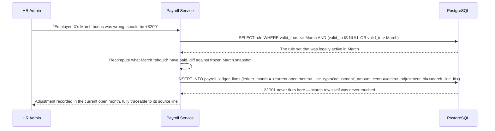
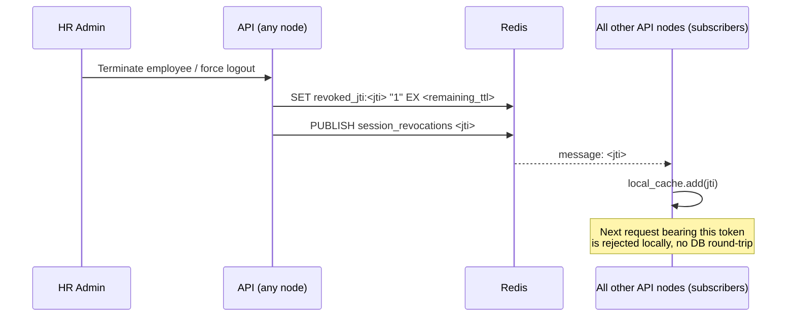
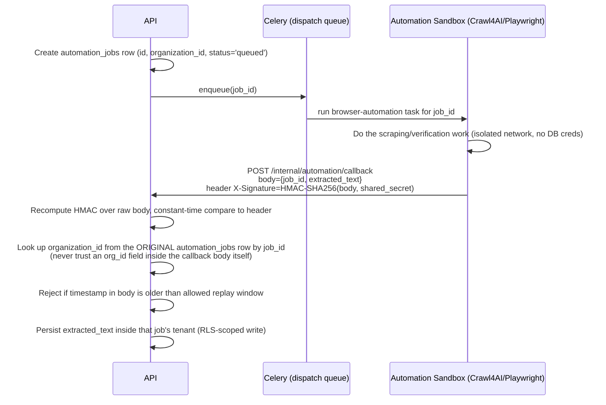
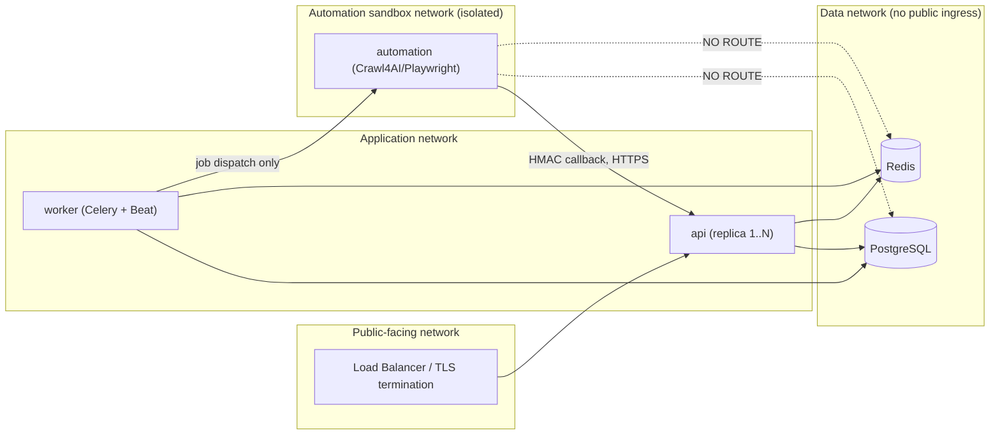

# System Architecture — Zero-Trust HRMS

**Companion document to `AGENT.md`.** That file tells an agent how to behave; this file explains
why the system is shaped the way it is, in enough technical depth that an implementation can be
built directly from it. Where the source project plan left an engineering detail unspecified, this
document makes an explicit, labeled decision (marked **[Design Decision]**) rather than leaving a
gap — treat those as defaults open to revision, not settled requirements.

---

## 1. Architecture Overview

```mermaid
flowchart TB
    subgraph Clients
        EMP["Employee Self-Service Portal<br/>(React + Vite)"]
        ADM["Admin / HR Control Center<br/>(React + Vite)"]
    end

    subgraph EdgeAPI["Hardened API Surface (FastAPI, async)"]
        MW["Tenant Context + AuthN/AuthZ Middleware"]
        ROUTERS["Routers: auth, invitations, attendance,<br/>leave, payroll, offboarding, automation-ingress"]
    end

    subgraph Data["Data & Caching Layer"]
        PG[("PostgreSQL<br/>RLS + Exclusion Constraints + Triggers")]
        REDIS[("Redis<br/>Revocation Pub/Sub, Locks, Cache")]
    end

    subgraph Async["Async & Automation Layer"]
        CELERY["Celery Workers"]
        BEAT["Celery Beat<br/>(cron: ledger close, midnight sync)"]
        AUTOSANDBOX["Automation Sandbox Network<br/>Crawl4AI + Playwright"]
    end

    EMP -->|HTTPS + HttpOnly cookie| MW
    ADM -->|HTTPS + HttpOnly cookie| MW
    MW --> ROUTERS
    ROUTERS -->|SET LOCAL org_id, SQL| PG
    ROUTERS -->|jti check / lock / pubsub| REDIS
    ROUTERS -->|enqueue job| CELERY
    BEAT -->|scheduled tasks| CELERY
    CELERY -->|dispatch scraping job| AUTOSANDBOX
    AUTOSANDBOX -->|HMAC-signed callback<br/>ONE WAY IN| ROUTERS
    CELERY --> PG
    CELERY --> REDIS

    style AUTOSANDBOX fill:#3a1f1f,stroke:#c0392b,stroke-width:2px
    style PG fill:#1f2e3a,stroke:#2c7fb8,stroke-width:2px
```



**Key property:** the automation sandbox has no arrow pointing *into* PostgreSQL or Redis directly —
it can only reach the rest of the system through one signed HTTP callback endpoint. This is
deliberate containment, not an oversight (see §8).

---

## 2. Component Inventory

| Component | Responsibility | Talks to |
|---|---|---|
| `web-employee` | Clock-in/out, leave requests, personal profile, payslip view | API only, via HttpOnly-cookie-authenticated fetch/Axios |
| `web-admin` | Org hierarchy, approvals, payroll matrices, invitations, offboarding | API only |
| `api` (FastAPI) | Single API surface for both frontends; all business logic and validation | PostgreSQL, Redis, Celery (enqueue only) |
| `worker` (Celery) | Invitation emails, midnight delta sync, ledger close, automation job dispatch | PostgreSQL, Redis, `automation` (enqueue only) |
| `automation` (Crawl4AI/Playwright) | Corporate document/browser-based verification tasks | Nothing but its own queue in, HMAC callback out |
| PostgreSQL | System of record; enforces tenant isolation, leave-overlap safety, ledger immutability | — |
| Redis | Session-revocation broadcast, distributed locks, short-lived caches | — |

---

## 3. Request Lifecycle & Tenant Context Propagation

This is the mechanism behind Prime Directive #1 in `AGENT.md`. The critical detail is that
`SET LOCAL` is **transaction-scoped**: it must be executed on the *same* database connection and
inside the *same* transaction that will run the request's actual queries, and it automatically
resets when that transaction ends. A global "set it once per connection" approach is unsafe under
connection pooling, because a pooled connection is reused across different tenants' requests.



**[Design Decision]** Implementation pattern for the dependency:

```python
# src/db/session.py
from contextlib import asynccontextmanager
from sqlalchemy.ext.asyncio import AsyncSession
from sqlalchemy import text

@asynccontextmanager
async def tenant_scoped_session(session_factory, organization_id: str):
    async with session_factory() as session:
        async with session.begin():
            await session.execute(
                text("SET LOCAL app.current_organization_id = :org_id"),
                {"org_id": organization_id},
            )
            yield session
        # COMMIT happens automatically on clean exit of session.begin();
        # ROLLBACK happens automatically if an exception propagates.

# src/core/deps.py
async def get_db(request: Request) -> AsyncIterator[AsyncSession]:
    ctx: TenantContext = request.state.tenant_context  # set by auth middleware
    async with tenant_scoped_session(session_factory, str(ctx.organization_id)) as session:
        yield session
```

Superadmin/cross-tenant operations (e.g., an internal support tool) must use a **separate,
explicitly named dependency** (e.g., `get_platform_db`) that never sets the session variable, is
gated behind a distinct platform-admin role check, and is called out by name in any PR touching it —
it must never be the default path.

---

## 4. Data Architecture

### 4.1 Core Schema Overview (selected tables)



Every one of `employees`, `invitations`, `clock_events`, `leave_requests`, `payroll_ledger_lines`,
and `payroll_rules` carries `organization_id UUID NOT NULL REFERENCES organizations(id)` and an RLS
policy per §4.2. `pseudonymization_map` is keyed by the *original* employee id but deliberately
lives outside the RLS-scoped read path for normal operational queries (see §4.5).

### 4.2 Row-Level Security Design

```sql
-- One-time setup migration
CREATE EXTENSION IF NOT EXISTS pgcrypto;   -- gen_random_uuid()
CREATE EXTENSION IF NOT EXISTS citext;     -- case-insensitive email

-- Applied to every tenant-scoped table, e.g. `employees`:
ALTER TABLE employees ENABLE ROW LEVEL SECURITY;
ALTER TABLE employees FORCE ROW LEVEL SECURITY;  -- applies even to the table owner role

CREATE POLICY tenant_isolation_employees ON employees
    USING (organization_id = current_setting('app.current_organization_id', true)::uuid)
    WITH CHECK (organization_id = current_setting('app.current_organization_id', true)::uuid);
```

Notes:
- The `true` second argument to `current_setting` makes it return `NULL` instead of raising when
  unset, so a session that *forgot* to set the tenant context fails closed (no rows match `NULL`)
  rather than erroring in a way that might get quietly swallowed.
- `FORCE ROW LEVEL SECURITY` is required — without it, the table owner (often the same role the app
  connects as, in simple setups) silently bypasses RLS. **[Design Decision]** the application's
  runtime DB role should be a non-owner role specifically so this isn't a foot-gun; owner-level
  access is reserved for the migration-runner role only.
- The RLS adversarial test suite (see `master_prompt_set.md` Prompt 16) is the thing that actually
  proves this works — a policy that merely exists is not sufficient evidence.

### 4.3 Leave Scheduler — Exclusion Constraint Design

```sql
CREATE EXTENSION IF NOT EXISTS btree_gist;

CREATE TABLE leave_requests (
    id               UUID PRIMARY KEY DEFAULT gen_random_uuid(),
    organization_id  UUID NOT NULL REFERENCES organizations(id),
    employee_id      UUID NOT NULL REFERENCES employees(id),
    start_time       TIMESTAMPTZ NOT NULL,
    end_time         TIMESTAMPTZ NOT NULL,
    status           TEXT NOT NULL DEFAULT 'pending', -- pending | approved | rejected | cancelled
    period           TSTZRANGE GENERATED ALWAYS AS (tstzrange(start_time, end_time, '[]')) STORED,
    created_at       TIMESTAMPTZ NOT NULL DEFAULT now(),
    CONSTRAINT valid_leave_range CHECK (end_time > start_time)
);

ALTER TABLE leave_requests ENABLE ROW LEVEL SECURITY;
ALTER TABLE leave_requests FORCE ROW LEVEL SECURITY;
CREATE POLICY tenant_isolation_leave_requests ON leave_requests
    USING (organization_id = current_setting('app.current_organization_id', true)::uuid)
    WITH CHECK (organization_id = current_setting('app.current_organization_id', true)::uuid);

-- The actual overlap guard — only "live" requests (pending/approved) block each other;
-- a rejected or cancelled request must not.
ALTER TABLE leave_requests
    ADD CONSTRAINT no_overlapping_active_leave
    EXCLUDE USING gist (
        employee_id WITH =,
        period WITH &&
    ) WHERE (status IN ('pending', 'approved'));
```

Because the constraint is partial (`WHERE status IN (...)`), approving/rejecting a request is a
plain `UPDATE`, and a rejected request no longer participates in overlap checks — no need to delete
history. A double-submit or genuine race between two concurrent transactions results in the second
`INSERT` raising a Postgres `exclusion_violation` (SQLSTATE `23P01`), which the service layer maps
to a `409 Conflict` — this is the only correctness guarantee that matters; any Python-side
pre-check is UX sugar only (see `AGENT.md` §13 for the forbidden alternative).

### 4.4 Temporal Rule Engine & Payroll Ledger

```sql
CREATE TABLE payroll_rules (
    id                UUID PRIMARY KEY DEFAULT gen_random_uuid(),
    organization_id   UUID NOT NULL REFERENCES organizations(id),
    rule_type         TEXT NOT NULL,   -- 'tax_bracket' | 'contribution_multiplier' | 'bonus_policy' ...
    rule_key          TEXT NOT NULL,   -- e.g. contract tier or jurisdiction code
    rule_value        JSONB NOT NULL,  -- the actual parameters, shape depends on rule_type
    valid_from        TIMESTAMPTZ NOT NULL,
    valid_to          TIMESTAMPTZ,     -- NULL = currently active
    created_at        TIMESTAMPTZ NOT NULL DEFAULT now(),
    CONSTRAINT valid_rule_range CHECK (valid_to IS NULL OR valid_to > valid_from)
);

CREATE INDEX idx_payroll_rules_lookup
    ON payroll_rules (organization_id, rule_type, rule_key, valid_from);

CREATE TABLE payroll_ledger_lines (
    id                        UUID PRIMARY KEY DEFAULT gen_random_uuid(),
    organization_id           UUID NOT NULL REFERENCES organizations(id),
    employee_id               UUID NOT NULL REFERENCES employees(id),
    ledger_month              DATE NOT NULL,      -- always first-of-month
    line_type                 TEXT NOT NULL,      -- base_salary | bonus | deduction | adjustment
    amount_cents              BIGINT NOT NULL,
    currency                  CHAR(3) NOT NULL,
    status                    TEXT NOT NULL DEFAULT 'open',  -- open | closed
    adjustment_of             UUID REFERENCES payroll_ledger_lines(id),
    computed_from_rule_id     UUID REFERENCES payroll_rules(id),
    created_at                TIMESTAMPTZ NOT NULL DEFAULT now(),
    closed_at                 TIMESTAMPTZ
);

-- Immutability trigger: the actual enforcement of "closed months are frozen"
CREATE OR REPLACE FUNCTION prevent_closed_ledger_mutation() RETURNS TRIGGER AS $$
BEGIN
    IF OLD.status = 'closed' THEN
        RAISE EXCEPTION 'payroll_ledger_lines % is closed and cannot be modified (month=%)',
            OLD.id, OLD.ledger_month
            USING ERRCODE = 'raise_exception';
    END IF;
    RETURN NEW;
END;
$$ LANGUAGE plpgsql;

CREATE TRIGGER trg_prevent_closed_ledger_mutation
    BEFORE UPDATE OR DELETE ON payroll_ledger_lines
    FOR EACH ROW EXECUTE FUNCTION prevent_closed_ledger_mutation();
```

**Back-dated adjustment workflow:**



The rule lookup is what makes this safe under later rule changes: even if this year's tax brackets
have since changed, the reconstruction always queries "what was valid **on the date the original
pay period covered**," not "what's valid today."

### 4.5 GDPR Pseudonymization Data Model

```sql
CREATE TABLE pseudonymization_map (
    original_employee_id  UUID PRIMARY KEY REFERENCES employees(id),
    pseudonym_hash        TEXT NOT NULL UNIQUE,   -- HMAC-SHA256(employee_id, pepper), hex-encoded
    structural_cohort     TEXT NOT NULL,          -- e.g. 'Engineering / Region: East'
    pseudonymized_at      TIMESTAMPTZ NOT NULL DEFAULT now(),
    requested_by          TEXT NOT NULL           -- 'employee_request' | 'org_admin_request'
);
```

**[Resolved - ADR-0001]** Reading "a deterministic, cryptographically peppered/salted hash stored
securely outside the database" from the source plan: the *pepper* (the secret HMAC key) is what
lives outside the database — in a secrets manager (e.g., a KMS-backed secret store), never in a
table or in application config checked into source control. The resulting *hash* is what gets
persisted in `pseudonymization_map`, replacing the plaintext identifiers everywhere else. This is
the standard reading of that requirement and the only one that keeps the hash queryable; flag this
explicitly to a human reviewer as the interpretation being built against. See [ADR-0001](docs/adr/0001-gdpr-pepper-storage.md).

```mermaid
sequenceDiagram
    participant EMP as Employee
    participant API as Offboarding Service
    participant PG as PostgreSQL
    participant KMS as Secrets Manager

    EMP->>API: Right-to-be-forgotten request
    API->>API: Confirm employee already soft-deleted (terminated) — pseudonymization never runs on active employees
    API->>KMS: Fetch pseudonymization pepper
    API->>API: hash = HMAC-SHA256(employee_id, pepper)
    API->>PG: BEGIN
    API->>PG: INSERT INTO pseudonymization_map (original_employee_id, pseudonym_hash, structural_cohort, ...)
    API->>PG: UPDATE employees SET name='[REDACTED]', email=NULL, ... WHERE id = employee_id
    API->>PG: UPDATE payroll_ledger_lines / clock_events / leave_requests SET high_entropy_fields rolled up to cohort, amounts UNCHANGED
    API->>PG: COMMIT
    PG-->>API: Historical payroll math is untouched; identity is gone
```

The critical property: **numeric fields in historical rows are never modified** by this pipeline —
only identifying/high-entropy descriptive fields are rolled up or removed. This is what "preserving
the mathematical and structural integrity of historical payroll logs" means concretely: a finance
audit re-summing totals by cohort before and after pseudonymization must get the same numbers.

---

## 5. AuthN/AuthZ & Tiered Session Revocation Architecture



- **Access tokens** are short-lived JWTs (**[Design Decision]** ~10 minutes) carrying `sub` (user
  id), `org_id`, `role`, `jti`, `iat`, `exp`.
- **Refresh tokens** are longer-lived, delivered as `HttpOnly`, `Secure`, `SameSite=Strict` cookies,
  rotated on every use (old refresh token invalidated the moment a new one is issued).
- **Fast path:** each request's middleware checks the token's `jti` against a local in-process
  cache first (a bounded TTL map, sized to hold at least one access-token-lifetime's worth of
  revocations). Only on process startup — before the local cache has had time to receive any
  Pub/Sub messages — does a node need to hydrate from Redis directly (e.g., `SCAN` for
  `revoked_jti:*`, or maintain a small Redis sorted set of currently-active revocations for cheap
  bulk hydration).
- **[Resolved - ADR-0002] Bulk revocation extension:** for "revoke *all* sessions for user X" (as
  opposed to one token), maintain a secondary Redis key `tokens_valid_after:<user_id> = <timestamp>`
  and have the middleware also reject any token whose `iat` predates that watermark. This avoids
  needing to enumerate and blacklist every outstanding `jti` for a user individually when, e.g., an
  account is confirmed compromised. This is presented as a recommended extension to the jti-blacklist
  mechanism described in the source plan, not a replacement for it. See [ADR-0002](docs/adr/0002-session-revocation-watermark.md).

---

## 6. Attendance Engine

- `clock_events` rows store `event_type` (`clock_in`/`clock_out`), `recorded_at TIMESTAMPTZ NOT
  NULL DEFAULT now()` — **the server sets this value; the client cannot supply it.** Any
  client-submitted timestamp field on this endpoint is ignored for the authoritative value and, at
  most, logged separately for client-clock-skew diagnostics.
- `employees.timezone` is an IANA string (e.g., `Asia/Kolkata`), validated server-side against the
  system's tz database at write time (reject anything that doesn't resolve).
- Reporting queries convert at query time: `recorded_at AT TIME ZONE employees.timezone`, never by
  storing a second, pre-converted timestamp column (which would drift if an employee's timezone is
  later corrected).

---

## 7. Invitation System

```sql
CREATE TABLE invitations (
    id                UUID PRIMARY KEY DEFAULT gen_random_uuid(),
    organization_id   UUID NOT NULL REFERENCES organizations(id),
    email             CITEXT NOT NULL,
    token_hash        TEXT NOT NULL UNIQUE,  -- SHA-256 of the raw token; raw token is never stored
    role              TEXT NOT NULL,
    invited_by        UUID NOT NULL REFERENCES employees(id),
    expires_at        TIMESTAMPTZ NOT NULL,  -- created_at + 24 hours, enforced at insert time
    used_at           TIMESTAMPTZ,
    created_at        TIMESTAMPTZ NOT NULL DEFAULT now()
);
```

- The raw token is emailed once and never persisted — only its SHA-256 hash is stored, so a
  database read of this table alone cannot be used to mint valid invitations.
- Single-use enforcement is a conditional update, not a read-then-write:
  ```sql
  UPDATE invitations
     SET used_at = now()
   WHERE id = :id AND used_at IS NULL AND expires_at > now()
  RETURNING id;
  ```
  If this returns zero rows, the token was already used, expired, or invalid — the registration
  attempt fails uniformly for all three cases (no distinguishing error message, to avoid leaking
  which case applies).
- The token is bound to the specific `email` at issuance; registration must supply the same email
  the invitation was issued for, checked before the conditional update above runs.

---

## 8. Sandboxed Automation & Scraping Ingress



- The sandbox network has **no route to PostgreSQL or Redis** — only outbound HTTPS to the single
  internal callback endpoint and whatever external sites it's verifying/scraping.
- Container resource limits (CPU/memory caps) are applied specifically because headless-browser
  workloads are the most likely source of an accidental memory-exhaustion DoS; isolating the network
  also means such a spike can't starve the user-facing API process.
- The callback endpoint independently re-derives tenant context from its own prior job record — this
  is the same principle as Prime Directive #1: never trust a caller's claim about which tenant a
  payload belongs to; re-derive it from something the system itself created earlier.
- **[Design Decision]** replay protection: include an `issued_at` in the signed payload and reject
  callbacks older than a few minutes, even with a valid signature, in case a callback is ever
  captured and resent.

---

## 9. Frontend Architecture

- Two independent Vite/React SPAs (`web-employee`, `web-admin`) against the same API, sharing a
  generated TypeScript client (`packages/shared-types`, produced from the API's OpenAPI schema) so
  request/response shapes can't drift between the two apps.
- **Cookie-refresh interceptor pattern** (both apps use the same module, see
  `master_prompt_set.md` Prompt 14):
  1. Access token is held in memory (a module-level variable or a state store), never in
     `localStorage`.
  2. Refresh token is an `HttpOnly` cookie the JS never touches directly; the browser sends it
     automatically to the refresh endpoint.
  3. On a `401`, the interceptor triggers a refresh call; while a refresh is in flight, any other
     requests that also 401 queue behind a single shared promise instead of each firing their own
     refresh (preventing a refresh-token race that would invalidate a token another request just
     rotated in).
  4. On refresh success, the original request(s) retry once with the new access token. On refresh
     failure, the app clears in-memory state and redirects to login — it does not infinitely retry.

---

## 10. Deployment Topology & Network Segmentation



Each `api` replica is stateless except for its local in-memory revocation cache, which is why the
Redis Pub/Sub broadcast in §5 exists — it's what keeps N stateless replicas' local caches
consistent without a shared-state bottleneck on the request hot path.

---

## 11. Observability & Operational Concerns

- **Structured logs**: one JSON event per request/job, always tagged with `request_id` and
  `organization_id` where applicable, so per-tenant issue investigation doesn't require grepping
  free text.
- **Audit log**: administrative actions (role changes, payroll adjustments, offboarding/GDPR
  actions) are written to an append-only `audit_log` table, itself RLS-scoped, distinct from
  general application logs — this is what answers "who did what, when" during a compliance review.
- **Metrics [Design Decision, illustrative targets to tune with the team]:**
  - Session-revocation propagation: p99 under ~2 seconds from `PUBLISH` to all nodes' local caches
    updated.
  - API p95 latency on employee-facing endpoints (clock-in especially, given "high-concurrency" in
    the source plan): sub-200ms excluding network.
  - Payroll ledger close batch: must complete within its scheduled maintenance window with the
    ability to resume safely if interrupted (idempotent per-employee processing).

---

## 12. Threat Model Summary (STRIDE pass)

| Threat category | Primary mitigation in this architecture |
|---|---|
| Spoofing | Short-lived signed JWTs, rotated refresh tokens, invitation tokens bound to a specific email and single-use |
| Tampering | RLS at the database engine; payroll ledger immutability trigger; HMAC-signed automation callbacks |
| Repudiation | Append-only audit log for admin/payroll/offboarding actions |
| Information Disclosure | RLS tenant isolation; pseudonymization pipeline; automation sandbox network isolation; secrets never logged |
| Denial of Service | Automation sandbox isolated onto its own network/resource limits so a scraping-induced memory spike can't take down the user-facing API |
| Elevation of Privilege | Server-side role/permission checks on every admin endpoint independent of session validity; invitation-only registration removes the public sign-up attack surface entirely |

---

## 13. Open Design Decisions Flagged for Human Review

Everything tagged **[Design Decision]** above is a reasonable default chosen to make this document
buildable end-to-end, not a requirement pulled from the source plan. Before implementation begins in
earnest, a human should explicitly confirm or override:

1. Access-token lifetime (currently assumed ~10 minutes).
2. The bulk-revocation "valid-after watermark" extension in §5 (additive, not required). [Resolved - Accepted in ADR-0002](docs/adr/0002-session-revocation-watermark.md)
3. The interpretation of pepper-storage location in §4.5. [Resolved - Accepted in ADR-0001](docs/adr/0001-gdpr-pepper-storage.md)
4. Illustrative latency/propagation targets in §11 — these need real numbers from the team's actual
   SLAs, not the placeholders here.
